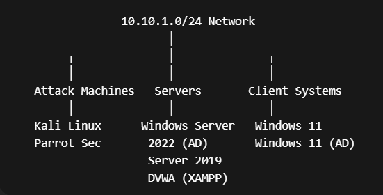
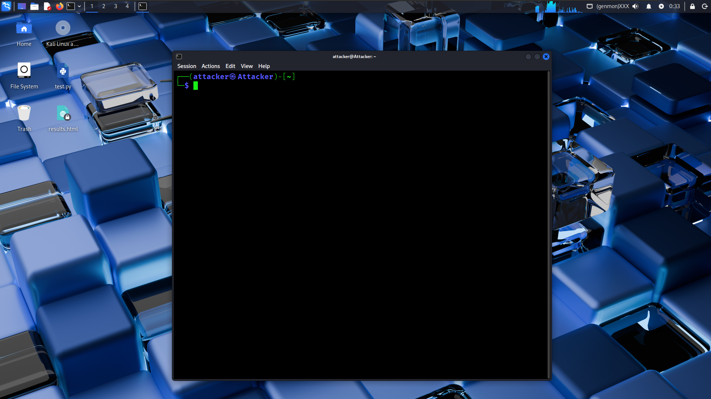
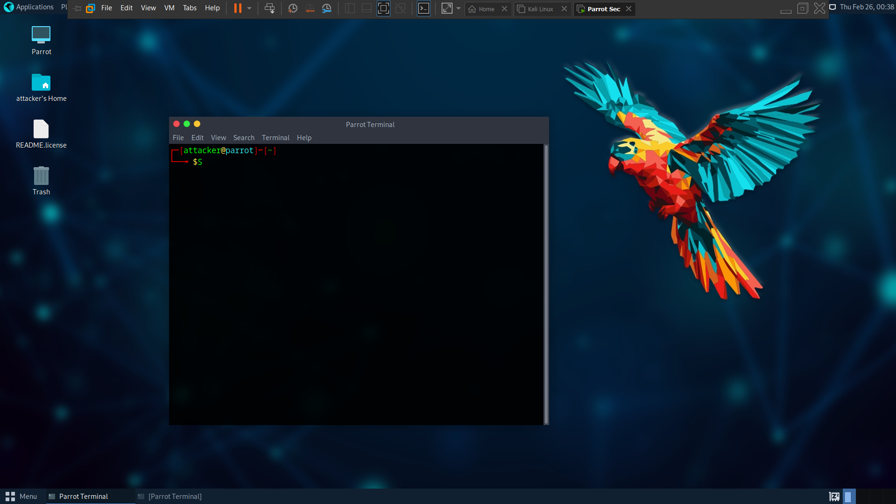
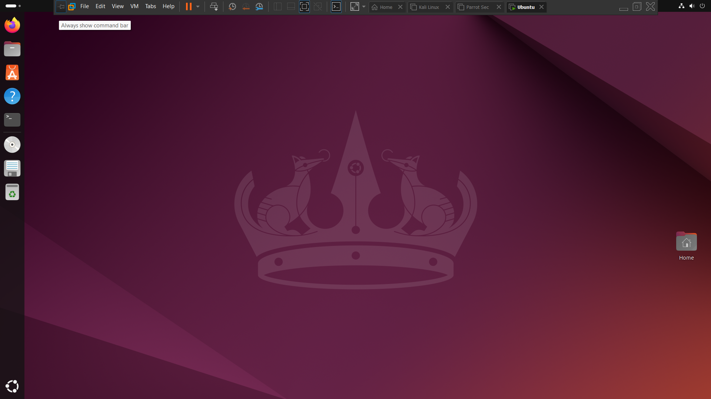
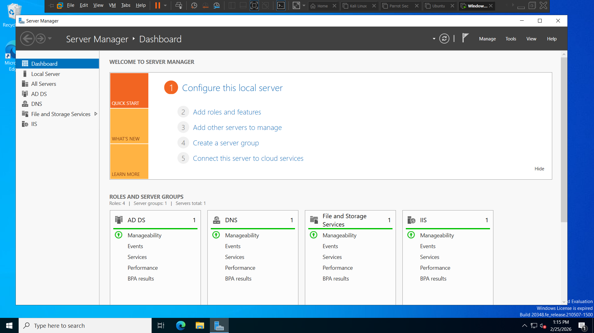
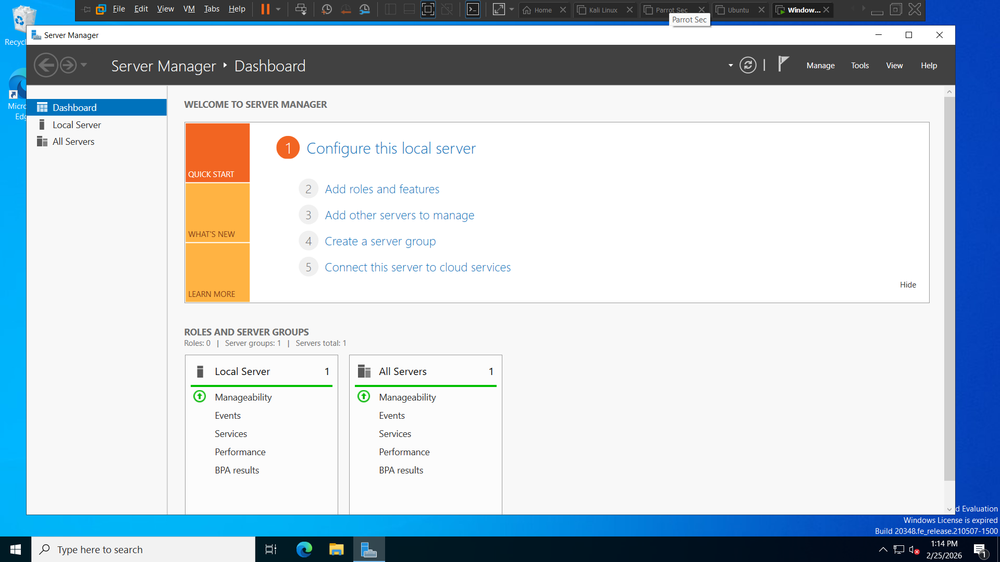

# 🔐 Cybersecurity Home Lab (Enterprise Simulation)

This project demonstrates the design and deployment of a fully functional cybersecurity home lab built using virtualization.

Instead of running isolated tools, this lab simulates a real-world enterprise environment with multiple systems, Active Directory, and attack workflows.

---

## 📌 Lab Overview

The lab includes:

- Active Directory infrastructure  
- Domain Controller & Member Server  
- Windows & Linux machines  
- Attacker systems (Kali Linux & Parrot OS)  
- Vulnerable web application (DVWA)  
- Multi-user privilege environment  

This setup enables realistic practice of penetration testing and enterprise attack scenarios.

---

## 🧠 Objective

To gain hands-on experience beyond theory in:

- Network-based attacks  
- Active Directory exploitation  
- Privilege escalation  
- Lateral movement  
- Web application vulnerabilities  

---

## 🏗️ Lab Architecture

- **Platform:** VMware Workstation  
- **Network Range:** 10.10.1.0/24  
- **Subnet Mask:** 255.255.255.0  
- **Gateway:** 10.10.1.2  

An isolated internal network simulates a real enterprise LAN within a single machine.

---

## 🖼️ Lab Screenshots

### 🏗️ Architecture Overview

> Isolated lab network design (10.10.1.0/24)

---

### ⚔️ Attacker Machines

#### Kali Linux

#### Parrot OS

> Used for reconnaissance, enumeration, exploitation, and post-exploitation

---

### 🎯 Target Systems

#### Ubuntu Linux Target

#### Windows 11 (Standalone)

#### Windows 11 (Domain Joined)

> Used for privilege escalation, credential harvesting, and lateral movement

---

### 🏢 Active Directory Infrastructure

#### Windows Server 2022 (Domain Controller)

#### Windows Server 2019 (Member Server)

> Core of domain-based attack simulation and authentication

---

## ⚔️ Attack Machines

### Kali Linux
- Network scanning (Nmap)  
- Service enumeration  
- Exploitation  
- Post-exploitation  

### Parrot Security OS
- Alternative offensive toolset  
- Attack simulation diversity  

---

## 🎯 Target Systems

### Ubuntu Linux
- SSH brute force simulations  
- Misconfiguration exploitation  
- Privilege escalation  

### Windows 11 (Standalone)
- Local privilege escalation  
- Credential harvesting  
- Persistence testing  

### Windows 11 (Domain-Joined)
- Lateral movement  
- Domain-based attacks  
- Kerberos exploitation  

---

## 🏢 Active Directory Environment

### Windows Server 2022 (Domain Controller)
- Active Directory Domain Services  
- Central authentication  
- User & policy management  

### Windows Server 2019 (Member Server)
- Service account configurations  
- Attack path simulation  
- Privilege differentiation  

---

## 🌐 Vulnerable Web Application

### DVWA (Damn Vulnerable Web Application)

Configured using XAMPP:

- Apache  
- MySQL  
- Web application setup  

Used for practicing:

- SQL Injection  
- Cross-Site Scripting (XSS)  
- Command Injection  
- File Inclusion  
- CSRF attacks  

---

## 🔄 Attack Simulation Workflow

This lab supports a complete attack lifecycle:

1. Reconnaissance  
2. Enumeration  
3. Initial Access  
4. Privilege Escalation  
5. Credential Dumping  
6. Lateral Movement  
7. Domain Escalation  
8. Persistence  

---

## 🧰 Skills Demonstrated

- Network configuration & subnetting  
- Active Directory deployment  
- Windows & Linux system administration  
- Web server setup  
- Offensive security methodology  
- Post-exploitation techniques  

---

## 📂 Project Structure

